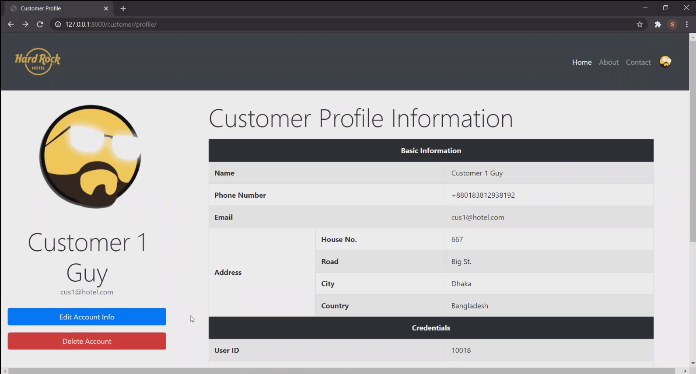
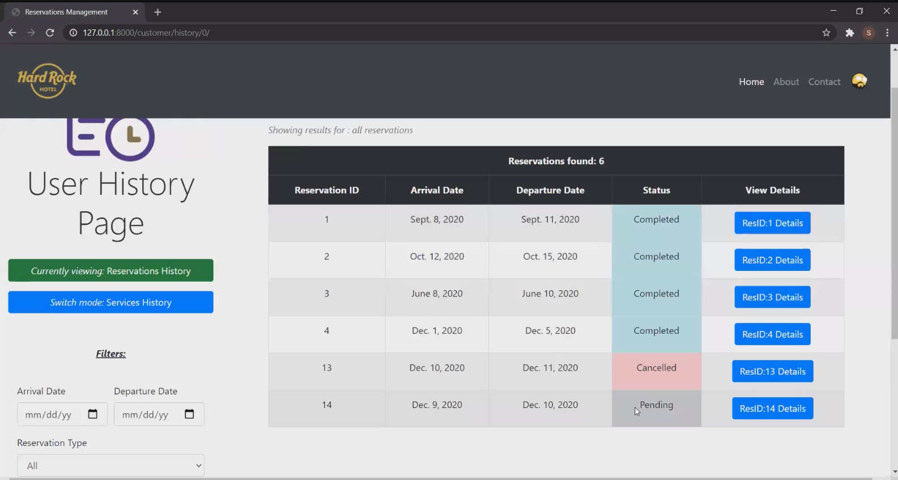
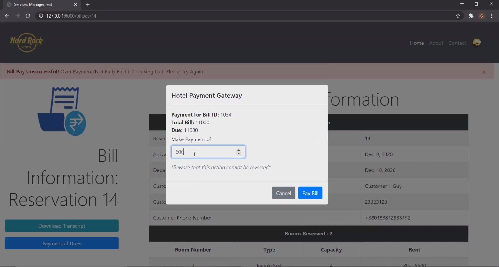
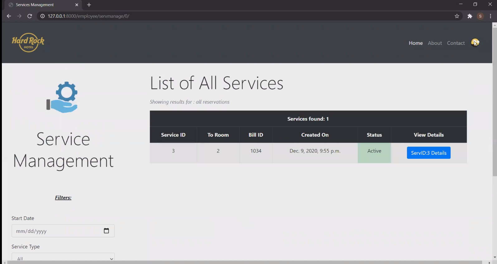
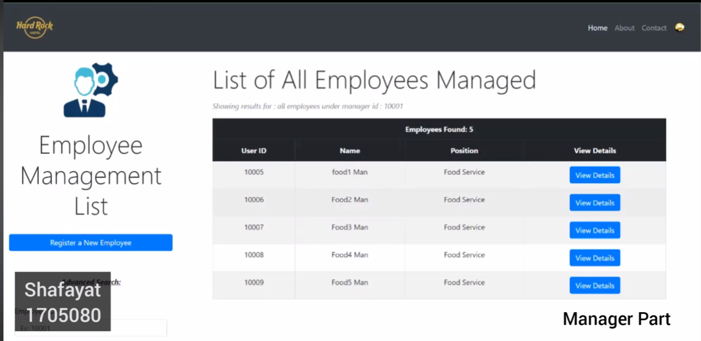
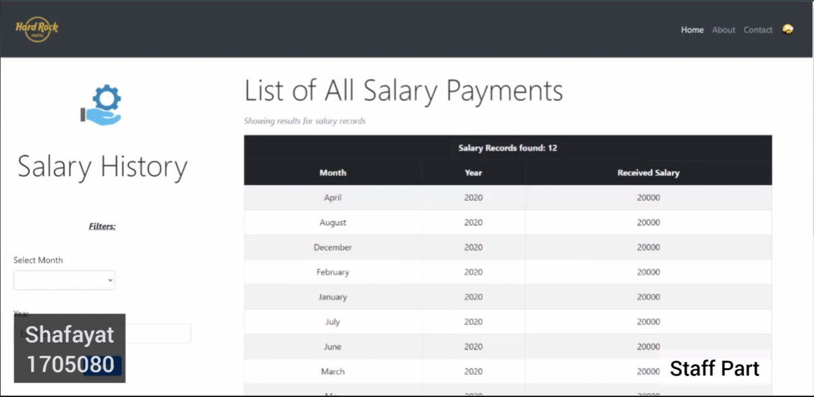

<a name="readme-top"></a>

<!-- PROJECT SHIELDS -->
[![Contributors][contributors-shield]][contributors-url]
[![Stargazers][stars-shield]][stars-url]
[![Youtube Link][youtube-shield]](https://youtu.be/JMN1UoSgFMU)


<!-- PROJECT LOGO -->
<br />
<div align="center">
  <a href="https://github.com/mrmajumder/Hotel-Management-Service">
    
  </a>

<h3 align="center">Hotel Management System</h3>
  <p align="center">
    A Full-stack All-encompassing Hotel Management Webapp
    <br />
    <br />
  </p>
</div>


<!-- TABLE OF CONTENTS -->
<details>
  <summary>Table of Contents</summary>
  <ol>
    <li>
      <a href="#about-the-project">About The Project</a>
      <ul>
        <li><a href="#built-with">Built With</a></li>
        <li><a href="#project-images">Project Images</a></li>
      </ul>
    </li>
    <li>
      <a href="#getting-started">Getting Started</a>
      <ul>
        <li><a href="#prerequisites">Prerequisites</a></li>
        <li><a href="#installation">Installation</a></li>
      </ul>
    </li>
    <li><a href="#contributors">Contributors</a></li>
    <!-- <li><a href="#acknowledgments">Acknowledgments</a></li> -->
  </ol>
</details>


<!-- ABOUT THE PROJECT -->
## About The Project

<!-- [![Product Name Screen Shot][product-screenshot]](https://example.com) -->
**Hotel Management System** is the term final project for the course "CSE 216: Database Sessional". The project consists of a webapp for a hotel, with integrated complete "Hotel Management System (HMS)" with database support. It contains various customer side features like:

* Customer signup, login and profile creation
* Reservation creation
* Hotel service ordering and cancellation
* Past history tracking.

The project also includes support for employees, such as: 
* Employee login feature
* Permissions, varying webapp features
* Upcoming tasks list
* Upcoming reservations and todos

Employee types implemented in our project are: `general staff`, `managers` and `director`. The director withholds the highest permission in the webapp, and has access to additional features such as:
* Creating and viewing an employee.
* Promoting, demoting and firing employees
* See all statistics of the hotel
* See status of rooms and modify them

Overall, this project provides a hotel with full-support from customer to employee management with database support, al under one roof. 

To know more about the database SQL queries, see the [database files](database%20files/) folder. To learn about the ER diagram of the project, see [this](images/erd.pdf).

This project received **full marks** with bonus.

<p align="right">(<a href="#readme-top">back to top</a>)</p>


### Built With

[](https://www.djangoproject.com/)
[![Bootstrap][Bootstrap.com]][Bootstrap-url]
[](https://www.python.org/)
[](https://www.oracle.com/database/)

<p align="right">(<a href="#readme-top">back to top</a>)</p>


### Project Images
<p float="left" align="middle">
  
   
  
   
   
   
</p>

<p align="right">(<a href="#readme-top">back to top</a>)</p>


<!-- GETTING STARTED -->
## Getting Started

This is an example of how you may set up your project locally.
To get a local copy up and running follow these simple example steps.

### Prerequisites

This is the list of things you need to use the software.
  ```sh
  python, django, oracle, bootstrap (can be included using mdn)
  ```


### Installation

1. Clone the repo
   ```sh
   git clone https://github.com/mrmajumder/Hotel-Management-Service.git
   ```
2. Run the following line to run the server
   ```sh
   python manage.py runserver
   ```
3. Open the development server at `http://127.0.0.1:8000/` and enjoy!

<p align="right">(<a href="#readme-top">back to top</a>)</p>


<!-- CONTRIBUTING -->
## Contributors

* Shafayat Hossain Majumder - [GitHub][github-url] | [LinkedIn][linkedin-url] | [Mail][email] | [Website][website-url]
* Sourov Jajodia - [GitHub](https://github.com/Sourov72) | [LinkedIn](https://www.linkedin.com/in/sourov72) | [Mail](mailto:sourov.jajodia72@gmail.com) | [Website](https://sourov72.github.io)


<p align="right">(<a href="#readme-top">back to top</a>)</p>


<!-- MARKDOWN LINKS & IMAGES -->
<!-- https://www.markdownguide.org/basic-syntax/#reference-style-links -->
[contributors-shield]: https://img.shields.io/github/contributors/mrmajumder/Hotel-Management-Service.svg?style=for-the-badge
[contributors-url]: https://github.com/mrmajumder/Hotel-Management-Service/graphs/contributors
[forks-shield]: https://img.shields.io/github/forks/mrmajumder/Hotel-Management-Service.svg?style=for-the-badge
[forks-url]: https://github.com/mrmajumder/Hotel-Management-Service/network/members
[stars-shield]: https://img.shields.io/github/stars/mrmajumder/Hotel-Management-Service.svg?style=for-the-badge
[stars-url]: https://github.com/mrmajumder/Hotel-Management-Service/stargazers
[issues-shield]: https://img.shields.io/github/issues/mrmajumder/Hotel-Management-Service.svg?style=for-the-badge
[issues-url]: https://github.com/mrmajumder/Hotel-Management-Service/issues
[license-shield]: https://img.shields.io/github/license/mrmajumder/Hotel-Management-Service.svg?style=for-the-badge
[license-url]: https://github.com/mrmajumder/Hotel-Management-Service/blob/master/LICENSE.txt
[linkedin-shield]: https://img.shields.io/badge/-LinkedIn-black.svg?style=for-the-badge&logo=linkedin&colorB=555
[linkedin-url]: https://linkedin.com/in/monsieurmajumder
[youtube-shield]: https://img.shields.io/badge/Video%20Demo-FF0000?style=for-the-badge&logo=youtube&logoColor=white
[github-url]: https://github.com/MrMajumder/
[email]: mailto:monsieurmajumder@gmail.com
[website-url]: https://mrmajumder.github.io/

[product-screenshot]: images/screenshot.png
[Next.js]: https://img.shields.io/badge/next.js-000000?style=for-the-badge&logo=nextdotjs&logoColor=white
[Next-url]: https://nextjs.org/
[React.js]: https://img.shields.io/badge/React-20232A?style=for-the-badge&logo=react&logoColor=61DAFB
[React-url]: https://reactjs.org/
[Vue.js]: https://img.shields.io/badge/Vue.js-35495E?style=for-the-badge&logo=vuedotjs&logoColor=4FC08D
[Vue-url]: https://vuejs.org/
[Angular.io]: https://img.shields.io/badge/Angular-DD0031?style=for-the-badge&logo=angular&logoColor=white
[Angular-url]: https://angular.io/
[Svelte.dev]: https://img.shields.io/badge/Svelte-4A4A55?style=for-the-badge&logo=svelte&logoColor=FF3E00
[Svelte-url]: https://svelte.dev/
[Laravel.com]: https://img.shields.io/badge/Laravel-FF2D20?style=for-the-badge&logo=laravel&logoColor=white
[Laravel-url]: https://laravel.com
[Bootstrap.com]: https://img.shields.io/badge/Bootstrap-563D7C?style=for-the-badge&logo=bootstrap&logoColor=white
[Bootstrap-url]: https://getbootstrap.com
[JQuery.com]: https://img.shields.io/badge/jQuery-0769AD?style=for-the-badge&logo=jquery&logoColor=white
[JQuery-url]: https://jquery.com 
